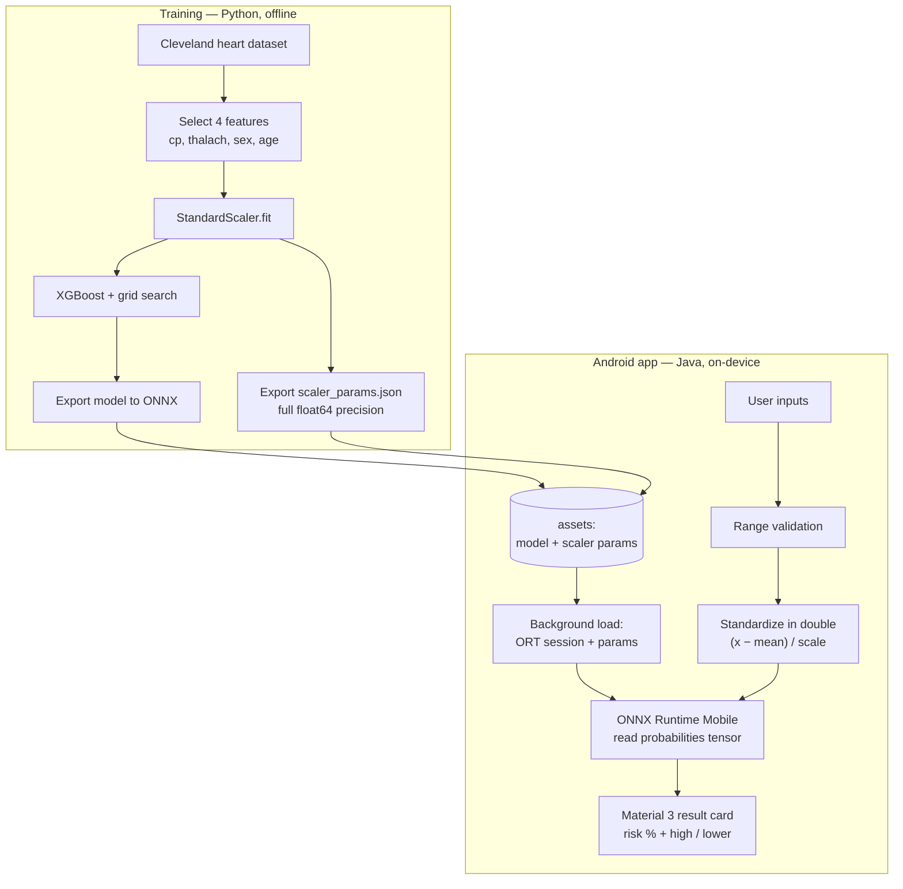

# HEART RISK CHECK

**An Android app that runs a gradient-boosted heart-disease model fully on-device via ONNX Runtime — with bit-exact train/serve parity and zero network calls.**

Heart Risk Check estimates cardiovascular risk from four simple inputs. The domain is a short health questionnaire; the engineering problem is not: it's making an XGBoost tree ensemble produce *exactly* the same probabilities on a phone as it did in the training notebook — entirely offline, with no Python runtime on the device. This README focuses on how that's built.

> **Medical disclaimer:** Educational project only. This is not a medical device, is not validated for clinical use, and is not a substitute for professional diagnosis. Do not make health decisions based on this app.


## Engineering highlights

- **On-device inference, zero network** — the model runs locally through ONNX Runtime Mobile; no input ever leaves the device and the app works fully offline. XGBoost is trained in Python, exported to ONNX, and served from Java with no backend.
- **Bit-exact train/serve parity** — the preprocessing `StandardScaler` is exported to a JSON asset at full `float64` precision and applied on-device in double precision before a single cast to `float32`. This is deliberate: XGBoost is a step function, so a *rounded* scaler constant can push an input across a tree split and flip the verdict near the 50% line. Verified against the reference Python pipeline at **0.0 max probability difference and zero classification flips**.
- **Explicit feature-order contract** — the model's input vector is ordered `[cp, thalach, sex, age]`; the app builds and standardizes features in that exact order, and the same order is asserted in the training export so the contract can't silently drift between notebook and app.
- **Correct probability extraction** — inference reads the model's `probabilities` output tensor (positive-class column), not the `label` output, and renders a graded percentage instead of a hard 0/1.
- **Non-blocking model load** — the ORT session and scaler params load on a background thread; the action button is gated until the model is ready and re-gated around each prediction, so the UI never stalls or races an unloaded session.
- **Reproducible pipeline** — a single training script emits all three shipped artifacts (`xgb_heart_model.onnx`, `scaler.pkl`, `scaler_params.json`); regenerating the model regenerates the exact scaling the app will apply.
- **Material 3, edge-to-edge** — a single-screen UI with a custom rose/neutral palette, full light **and** dark support, window-inset handling, a segmented sex control, an exposed-dropdown chest-pain picker, and a result card that recolors by risk level.

## System architecture



## Inputs & preprocessing

| Feature | Meaning | Input control |
|---|---|---|
| `cp` | Chest pain type (0–3) | Exposed dropdown |
| `thalach` | Maximum heart rate achieved | Number field (60–220) |
| `sex` | 0 = female, 1 = male | Segmented toggle |
| `age` | Age in years | Number field (20–100) |

Order is load-bearing: the vector is assembled as `[cp, thalach, sex, age]` to match the model's `float_input` exactly. Every input is range-validated before inference, and standardization uses the exported training statistics — `(x − mean) / scale` — computed in double precision to mirror scikit-learn, then cast once to `float32` for the tensor.

## Model & training

The classifier is an XGBoost model trained on the public Cleveland heart-disease dataset, selected via grid search and evaluated on a held-out split — see [`heard_disease_prediction_mdl_train_xgboost.py`](heard_disease_prediction_mdl_train_xgboost.py) for the full pipeline and metrics. The script fits a `StandardScaler` on the four features, trains and tunes the model, exports it to ONNX, and — the step that makes the app trustworthy — dumps the scaler's `mean_`/`scale_` to `scaler_params.json` in the model's feature order.

## Repository layout

```
app/
  src/main/
    java/com/example/heartpredictionapp/
      MainActivity.java       # UI, async model load, scaling, inference
    assets/
      xgb_heart_model.onnx    # exported model shipped with the app
      scaler_params.json      # exact StandardScaler mean/scale (train/serve parity)
    res/                      # Material 3 theme, layouts, colors (light + dark)
heard_disease_prediction_mdl_train_xgboost.py   # training + ONNX + scaler export
xgb_heart_model.onnx, scaler.pkl                # training artifacts (kept for provenance)
```

## Build & run

```bash
./gradlew :app:assembleDebug
adb install -r app/build/outputs/apk/debug/app-debug.apk
```

Builds against Android SDK 35 (minSdk 29) with JDK 21 and Gradle 8.10.2. The debug APK bundles ONNX Runtime native libraries for every ABI; a release build with ABI splits and minification is substantially smaller.

## License

Source-available for portfolio review; all rights reserved.

---

*A deliberately small, single-screen app — used as a clean example of shipping a classical-ML model to mobile with training-time fidelity.*
